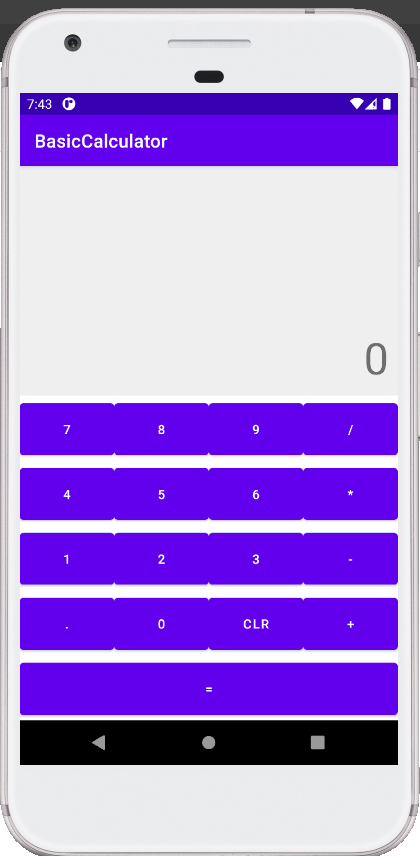
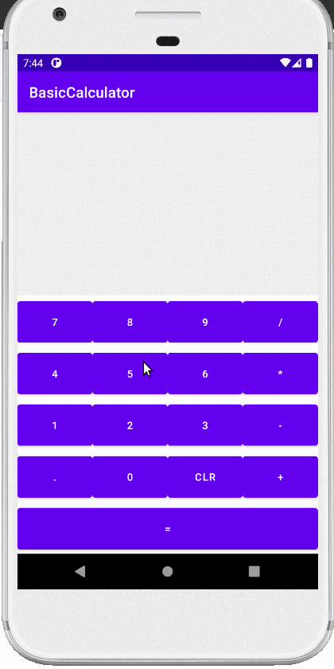

# BasicCalculator
<h3>Basic calculator app - finished project.</h3>

Application allows:
- addition,
- substraction,
- multiplication,
- division,
- clearing screen.

Used technologies:
- kotlin,
- Button and TextView.

<h3>Initial app screen:</h3>

<h3>App during usage:</h3>

